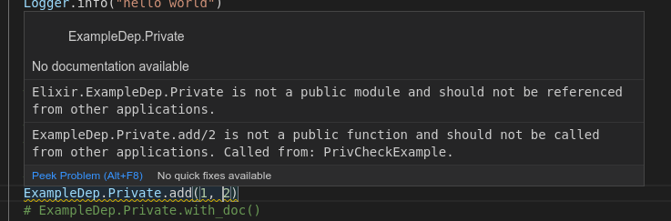
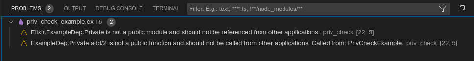

# PrivCheck

Elixir libraries can define a [private
API](https://hexdocs.pm/elixir/writing-documentation.html#hiding-internal-modules-and-functions)
by defining a module that is documented as `@moduledoc false`, or a function
that is defined as `@doc false`, that module or function should not be called or
referenced. PrivCheck is a library to generate warnings when private API's are
called.

## Raison D'etre

In Elixir it is quite easy to use private API's without realizing, especially if
the developer is just copying code from a blog post since there are no warnings
or errors emitted when using hidden modules. Part of Elixir's philosophy is to
help developers [fall into the pit of
success](https://blog.codinghorror.com/falling-into-the-pit-of-success/) (e.g.
make it easy to do the right thing). So we should make it easy for a developer
to avoid using the private API's. This library is my attempt to make this
guideline easy to follow.

The [usage of private
API's](https://elixirforum.com/t/proposal-private-modules-general-discussion/19374/151)
has caused downstream bugs, and resulted in a PSA due to [inadvertant breakage
in Elixir
v1.7](https://elixirforum.com/t/psa-do-not-use-private-apis-request-a-feature-instead/15449)

Building the concept of Private Modules into the language has been [proposed and
accepted](https://elixirforum.com/t/proposal-private-modules-general-discussion/19374/143),
but it has not yet been implemented.

## Installation

PrivCheck can be installed by adding `priv_check` to your list of dependencies
in `mix.exs`:

```elixir
def deps do
  [
    {:priv_check, "~> 0.2.2", runtime: false},
  ]
end
```

Next, in your project's `mix.exs` file in your `project` function add
`:priv_check` to the list of `:compilers` (adding it if it doesn't already
exist).

```elixir
def project do
  [
    ...
    compilers: [:priv_check] ++ Mix.compilers(),

    # If you're using Phoenix it will probably look a little more like this instead:
    compilers: [:priv_check, :phoenix, :gettext] ++ Mix.compilers(),
    ...
  ]
end
```

Then run `mix clean` and then `mix compile`

## Configuration

A configuration file can be provided that allows you to configure the behavior
of PrivCheck. In the root of your repository (same directory that has the
`mix.exs`) add a `.priv_check.exs` file. Here are some sample contents:

```elixir
%{
  # Relative path to files to skip checks for
  ignored_files: ["lib/ignored.ex"],

  # List of modules that are private, but warnings should be ignored
  ignore_references_to_modules: []
}
```

## Nomenclature: Private APIs vs Hidden modules

`@moduledoc false` hides the module from documentation (as implemented in
[ex_doc](https://github.com/elixir-lang/ex_doc)) which is an indication that the
module should not be used by consumers of the library.

## Usage

After following the [installation](#installation) instructions, when you compile
any code that accesses a private module or function will generate a warning.

Here is a sample warning:

```
warning: ExampleDep.Private.add/2 is not a public function
  and should not be called from other applications.
  Called from: PrivCheckExample.
  lib/priv_check_example.ex:21
```

Because PrivCheck is a mix compiler, it integrates seamlessly with editors which
can work with mix compilers. For example, in VSCode with
[ElixirLS](https://github.com/elixir-lsp/elixir-ls/):



And here is how it looks in VSCode's problems list:



## How it Works

PrivCheck uses the compiler tracing feature that was released in Elixir v1.10.
When elixir compiles the applications code it keeps a log of all referenced
modules and function calls. PrivCheck looks at those modules and functions, and
inspects their documentation to ascertain if they are hidden modules or
functions, if they are it emits a warning for each violation.

## Limitations

It is often expected that macro generated code will call hidden functions of its
containing library (for performance reasons). One example of this is
`Logger.info/2` (v1.9.4) in the standard library will call
`Logger.__should_log__/2` which is `@doc false`. Since the compiler tracing runs
after macros generate code, calling a macro like `Logger.info/2` would result in
a warning since the generated code calls a hidden function. In order to not
raise false positives on such code, PrivCheck ignores any lines that call a
remote macro.

## Known Issues

* Returns duplicate-looking warnings [#4](https://github.com/axelson/priv_check/issues/4)

## Related Concepts and Libraries

* Boundary: manage and restrain cross-module dependencies:
  https://github.com/sasa1977/boundary/
  * Was an inspiration for much of this library and can be used alongside
* Dialyzer `@opaque` types: a way to define that a specific struct or datatype
  should not be used outside of the module that it was defined in.
  * https://hexdocs.pm/elixir/typespecs.html#user-defined-types
  * https://hexdocs.pm/elixir/Kernel.html#defstruct/1-types
* Built-in private modules proposal:
  https://elixirforum.com/t/proposal-private-modules-general-discussion/19374/1
* Jose Valim's experiment in adding `defmodulep`: https://github.com/josevalim/defmodulep
